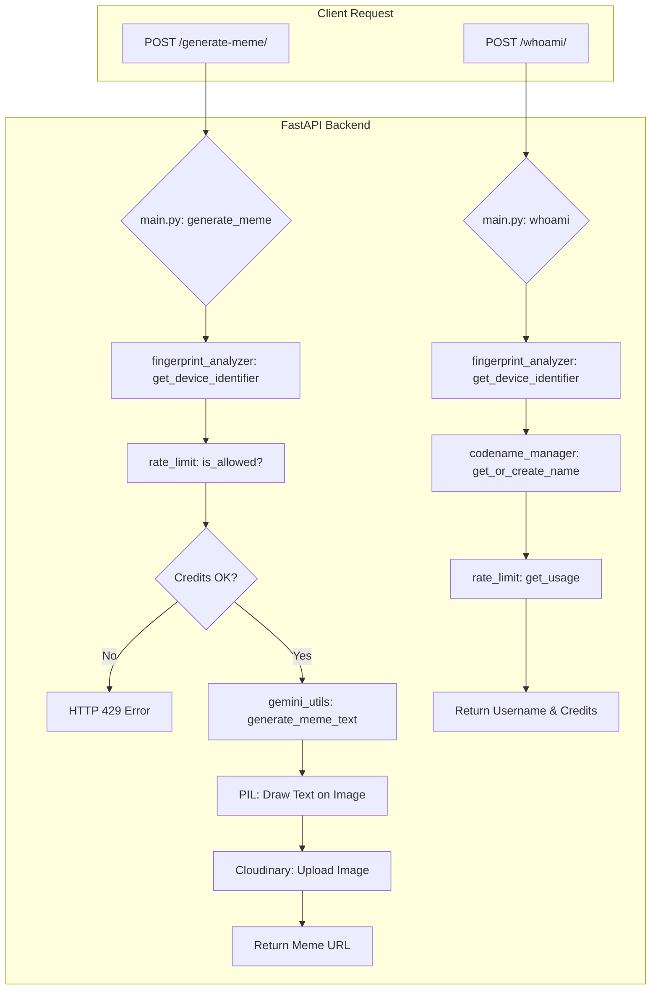

# Meme Aunty Backend - Code Architecture

## Meme Aunty
Your AI-Powered Indian Aunty Meme Generator 🚀

Meme Aunty is a full-stack meme generation platform that creates hilarious, culturally authentic Indian aunty memes using Google Gemini AI — like having your favorite aunty roast you, but in meme format.

## 🔥 Features

**AI-Powered Caption Generation**
- Google Gemini 2.5 Pro integration for contextual, image-aware captions
- Three distinct aunty personalities: Wholesome, Spicy, and Savage
- Dynamic prompt engineering based on selected vibe
- Automatic text formatting and meme-style capitalization

**Smart Rate Limiting & Security**
- Device fingerprinting using browser characteristics
- Daily quota system (10 memes per device)
- Rate limiting that works across incognito/multiple browsers
- IP fallback for devices without fingerprinting

**Advanced Image Processing**
- PIL-based text overlay with dynamic font sizing
- Adaptive text wrapping and positioning
- Text outline rendering for readability on any background
- Cloud storage integration with Cloudinary

**User Management**
- Fun codename generation for each device (e.g., "brave-penguin")
- Persistent user identity across sessions
- Usage tracking and credit monitoring
- Event logging for analytics

## 🛠️ Tech Stack

| Category | Technology |
|----------|------------|
| Backend | FastAPI, Python 3.13 |
| AI | Google Gemini 2.5 Pro API |
| Image Processing | Pillow (PIL), Custom font rendering |
| Storage | Cloudinary (image hosting) |
| Database | JSON files (rate limits, fingerprints, names) |
| Security | Device fingerprinting, Rate limiting |
| Logging | Custom event logging system |

## 📁 Project Structure
```
Server/
├── main.py                    → FastAPI app and main endpoints
├── gemini_utils.py           → Google Gemini AI integration
├── fingerprint_analyzer.py   → Device fingerprinting and anti-abuse
├── rate_limit.py             → Daily quota management system
├── codename_manager.py       → Fun username generation
├── logger.py                 → Event tracking and analytics
├── fonts/                    → Font files for meme text rendering
│   ├── impact.ttf           → Classic meme font
│   └── papyrus.ttf          → Alternative font option
├── memes/                    → Local meme storage (if needed)
└── __pycache__/              → Python bytecode cache
```

 ---

## 🔄 Application Flow



## 📂 Module Functions

## 📂 Module Functions

### **main.py** - FastAPI Application & Image Processing
- `generate_meme()` - POST endpoint that processes uploaded image, calls Gemini AI, renders text with PIL, uploads to Cloudinary
- `whoami()` - POST endpoint that analyzes device token, generates username, returns remaining credits (format: `{"username": "clever-mongoose", "credits": 7}`)
- `wrap_text()` - Splits long AI captions into multiple lines based on image width and font metrics using PIL's textlength()
- `draw_text_with_outline()` - Renders white text with black outline for visibility, adapts thickness based on image size

### **fingerprint_analyzer.py** - Anti-Abuse & Device Tracking
- `analyze_device_token()` - Parses "fingerprint-uuid" format, groups localStorage tokens by device fingerprint in JSON database
- `get_device_identifier()` - Returns device fingerprint for rate limiting, falls back to IP if no token provided
- `load_fingerprints()` / `save_fingerprints()` - JSON database operations for device_fingerprints.json
- Database structure: `{"abc123": ["uuid1", "uuid2"], "def456": ["uuid3"]}` (one device, multiple browser sessions)

### **gemini_utils.py** - AI Caption Generation with Google Gemini
- `generate_meme_text()` - Sends image bytes + vibe prompt to Gemini 2.5 Pro, returns uppercase meme text
- `get_prompt_by_vibe()` - Returns different Indian aunty personas: wholesome (family-friendly), spicy (sassy), savage (roasting)
- `image_to_gemini_payload()` - Converts PIL Image or raw bytes to Gemini's expected format for vision API calls

### **rate_limit.py** - Daily Quota System (10 memes/device/day)
- `is_allowed()` - Checks if device can generate more memes, creates/updates user records, enforces daily reset
- `get_usage()` - Returns remaining credits for device, automatically resets count if new day detected
- `load_limits()` / `save_limits()` - JSON operations for rate_limit.json 
- Database structure: `{"device_id": {"date": "2025-01-15", "count": 7}}` (tracks daily usage per device)

### **codename_manager.py** - Fun User Identity Generation
- `get_or_create_name()` - Generates memorable animal names like "clever-mongoose", "brave-penguin" for each device
- `load_names()` / `save_names()` - JSON operations for ip_names.json mapping device IDs to persistent usernames
- Uses `coolname` library to create family-friendly, memorable identifiers that users can recognize

### **logger.py** - Event Tracking & Analytics
- `log_event()` - Records meme generation events with timestamp, device ID, vibe selection, success/error status
- Writes structured logs to meme_logs.json for debugging, usage analytics, and monitoring system health

## 🛠️ Development Setup

```bash
# 📦 Install dependencies
pip install -r requirements.txt

# 🔑 Set environment variables for Gemini and Cloudinary in your shell
# export GEMINI_API_KEY="your_gemini_key"
# export CLOUDINARY_URL="cloudinary://..."

# 🚀 Run development server
python main.py

# 🌐 API available at http://localhost:8000
```
