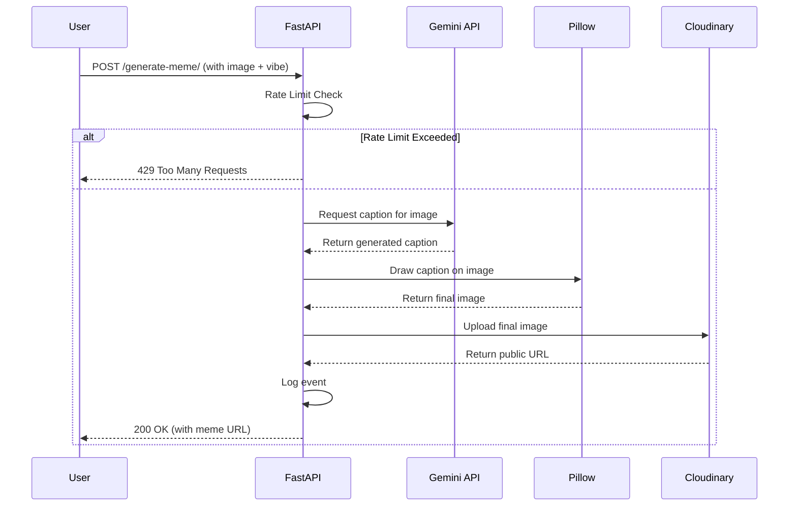

# Meme Generator API

This project is a Python-based API for generating memes. It uses FastAPI for the web framework, Pillow for image manipulation, and Google's Gemini API for generating meme captions.

## How It Works

The application receives an image and a desired "vibe" (wholesome, spicy, or savage), then uses the Gemini AI to generate a relevant caption. This caption is then drawn onto the image, which is uploaded to Cloudinary and the URL is returned.

### Core Concepts

The codebase is structured around a few key concepts:

1.  **API Endpoints (`main.py`):** Handles HTTP requests. The primary endpoint is `/generate-meme/`.
2.  **AI Caption Generation (`gemini_utils.py`):** Interfaces with the Gemini API to create meme text.
3.  **Image Manipulation (`main.py`):** Uses the Pillow library to draw text onto the uploaded image.
4.  **Rate Limiting (`rate_limit.py`):** Prevents abuse by limiting the number of memes a user can generate per day.
5.  **Logging (`logger.py`):** Records every meme generation event.

### Request Flow Diagram

Here's a diagram illustrating the journey of a request through the system:



## Codebase Breakdown

### `main.py` - The Core API

This is the main entry point of the application.

-   **Framework:** Uses `FastAPI` to create the web server and define endpoints.
-   **Dependencies:**
    -   `uvicorn`: The server that runs the FastAPI application.
    -   `Pillow`: For all image processing tasks.
    -   `cloudinary`: For uploading the final meme image.
    -   `python-dotenv`: To manage environment variables.
-   **Key Functions:**
    -   `generate_meme()`: The main endpoint logic. It orchestrates the calls to other modules.
    -   `wrap_text()`: A custom function to wrap long captions so they fit neatly on the image. It's superior to the standard `textwrap` library because it calculates wrapping based on **pixel width** rather than character count, which is essential for working with different fonts and image sizes.
    -   `draw_text_with_outline()`: Adds a black outline to the white text to ensure it's readable on any background.

### `gemini_utils.py` - The AI Brain

This module is responsible for communicating with the Google Gemini API.

-   **Key Functions:**
    -   `get_prompt_by_vibe()`: Selects a specific prompt template based on the `vibe` parameter (`wholesome`, `spicy`, or `savage`). This is how we instruct the AI to generate a caption with a particular style of humor.
    -   `generate_meme_text()`: Takes the image and the selected prompt, sends them to the Gemini API, and returns the generated text.

### `rate_limit.py` - The Gatekeeper

This module implements a simple IP-based rate limiting system to prevent spam and abuse.

-   **How it Works:**
    -   It maintains a JSON file (`rate_limit.json`) that stores the number of requests made by each IP address for the current day.
    -   The `is_allowed()` function checks if a given IP has exceeded the `DAILY_LIMIT`.
    -   The count for each IP resets daily.

### `logger.py` - The Scribe

This module logs every successful meme generation event to a file.

-   **How it Works:**
    -   The `log_event()` function records the timestamp, user IP, selected vibe, and the generated caption into `meme_logs.json`.
    -   This is useful for debugging, tracking usage, and seeing which vibes are most popular.

## Setup and Installation

1.  **Clone the repository.**
2.  **Create a virtual environment:**
    ```shell
    python -m venv venv
    ```
3.  **Activate the environment:**
    -   **Windows (PowerShell):** `.\venv\Scripts\Activate.ps1`
    -   **macOS/Linux:** `source venv/bin/activate`
4.  **Install dependencies:**
    ```shell
    pip install -r requirements.txt
    ```
5.  **Create a `.env` file** in the root directory and add your API keys:
    ```
    GEMINI_API_KEY="YOUR_GEMINI_API_KEY"
    CLOUDINARY_CLOUD_NAME="YOUR_CLOUDINARY_CLOUD_NAME"
    CLOUDINARY_API_KEY="YOUR_CLOUDINARY_API_KEY"
    CLOUDINARY_API_SECRET="YOUR_CLOUDINARY_API_SECRET"
    API_KEY="YOUR_CUSTOM_API_KEY"
    ```
6.  **Run the application:**
    ```shell
    uvicorn main:app --reload
    ```

The API will be available at `http://localhost:8000`.
