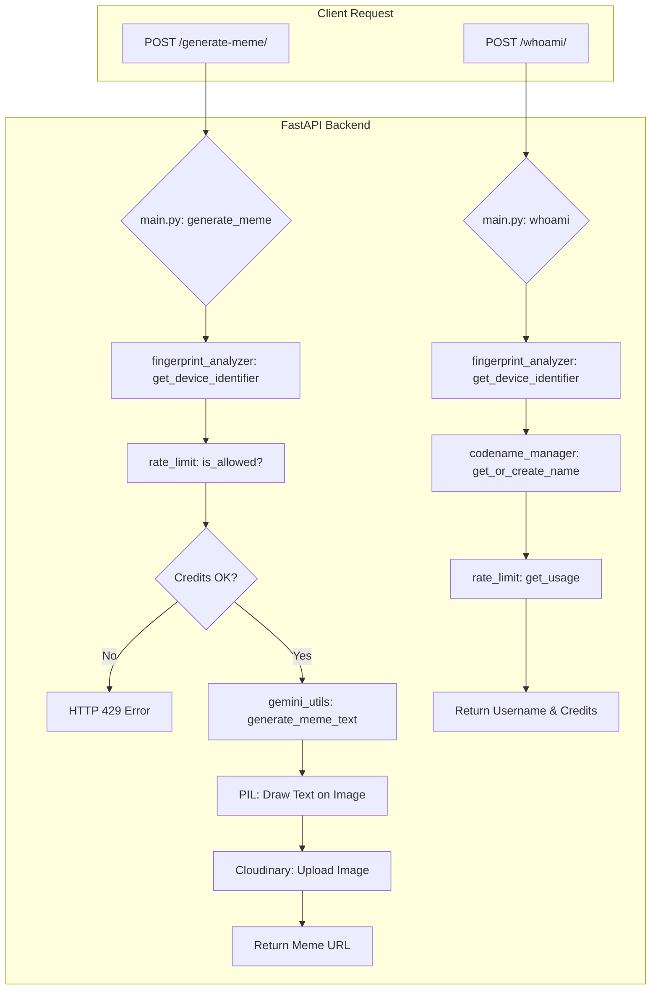

# 🤖 Meme Aunty Backend - Code Architecture Guide

## 📋 Overview
A FastAPI-powered backend that generates AI memes using Google Gemini, with device fingerprinting for rate limiting and Cloudinary for image hosting.

## 🏗️ Project Structure & Code Flow

```
Server/
├── main.py                    # FastAPI app & main endpoints
├── gemini_utils.py           # Google Gemini AI integration
├── fingerprint_analyzer.py   # Device fingerprinting logic
├── rate_limit.py             # Rate limiting system
├── codename_manager.py       # User identity management
├── logger.py                 # Event logging
├── fonts/                    # Font files for memes
└── memes/                    # Local meme storage (if needed)
```

---

## 🔄 Application Flow



## 📂 Module Functions

### **main.py** - API Endpoints & Image Logic
- `generate_meme()`: The main endpoint that orchestrates the entire meme generation process.
- `whoami()`: Identifies the user based on their device token and returns their codename and remaining credits.
- `wrap_text()`: Wraps the generated meme caption to fit within the image's width.
- `draw_text_with_outline()`: Renders the text onto the image using PIL, complete with an outline for readability.

### **fingerprint_analyzer.py** - Device Identification
- `analyze_device_token()`: Parses the combined device token to extract the core fingerprint.
- `get_device_identifier()`: Returns the most reliable identifier (fingerprint > IP address) for rate limiting.
- `load_fingerprints()` / `save_fingerprints()`: Manages the `device_fingerprints.json` database.

### **gemini_utils.py** - AI Caption Generation
- `generate_meme_text()`: Sends the image and a vibe-based prompt to the Google Gemini API to get a caption.
- `get_prompt_by_vibe()`: Selects a specific personality prompt (wholesome, spicy, or savage) based on user selection.
- `image_to_gemini_payload()`: Converts the uploaded image into a format that the Gemini API can process.

### **rate_limit.py** - Quota Management
- `is_allowed()`: Checks if a user has exceeded their daily meme generation limit.
- `get_usage()`: Calculates and returns the number of credits a user has left for the day.
- `load_limits()` / `save_limits()`: Manages the `rate_limit.json` database.

### **codename_manager.py** - User Identity
- `get_or_create_name()`: Assigns a fun, persistent codename (e.g., "clever-mongoose") to a new device identifier.
- `load_names()` / `save_names()`: Manages the `ip_names.json` database.

### **logger.py** - Event Logging
- `log_event()`: Records details of each meme generation event into `meme_logs.json`.

## 🛠️ Development Setup

```bash
# 📦 Install dependencies
pip install -r requirements.txt

# 🔑 Set environment variables for Gemini and Cloudinary in your shell
# export GEMINI_API_KEY="your_gemini_key"
# export CLOUDINARY_URL="cloudinary://..."

# 🚀 Run development server
python main.py

# 🌐 API available at http://localhost:8000
```
